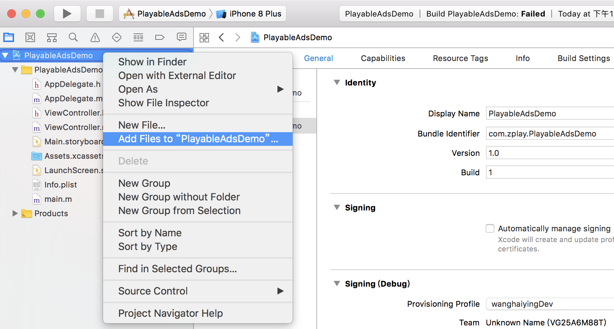
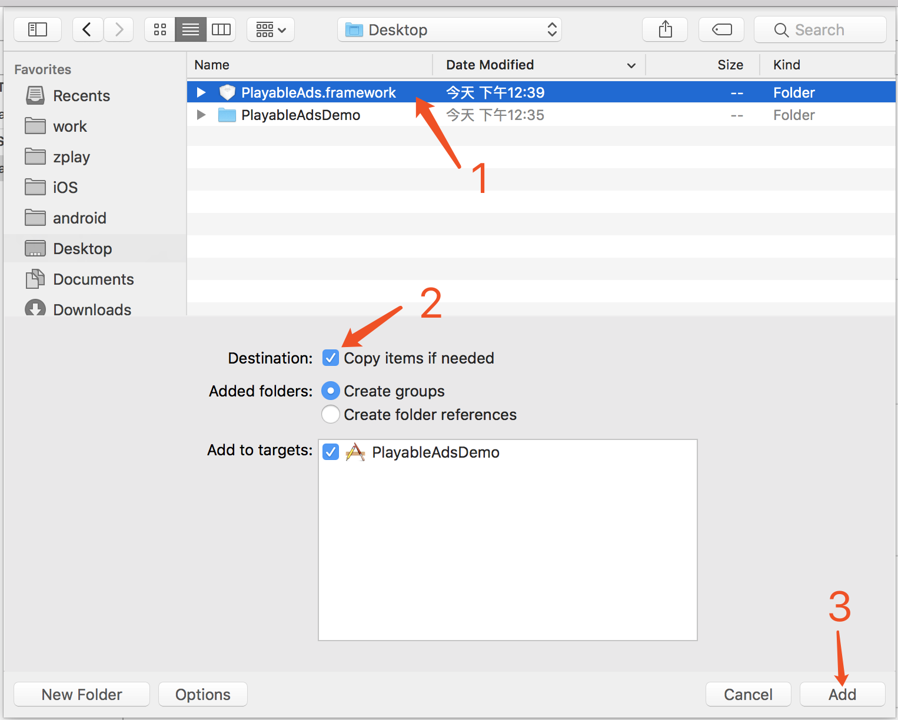
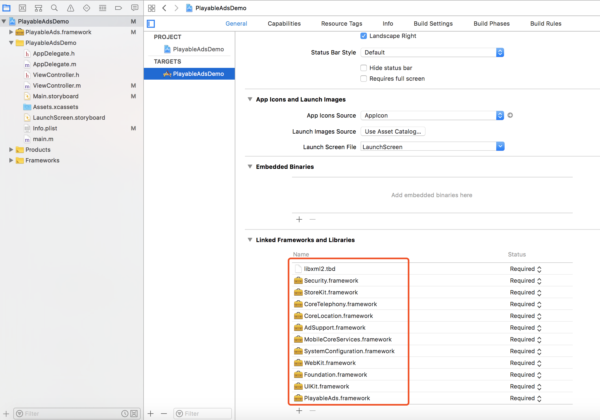
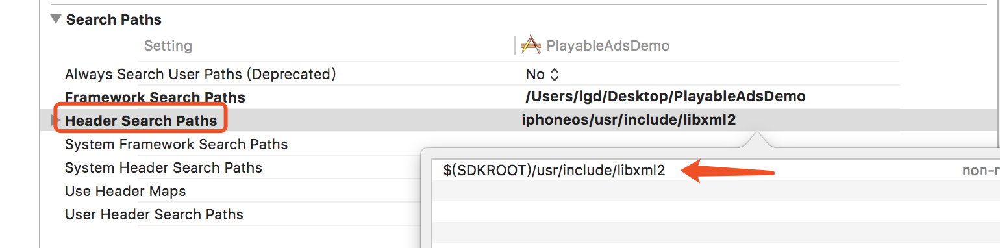
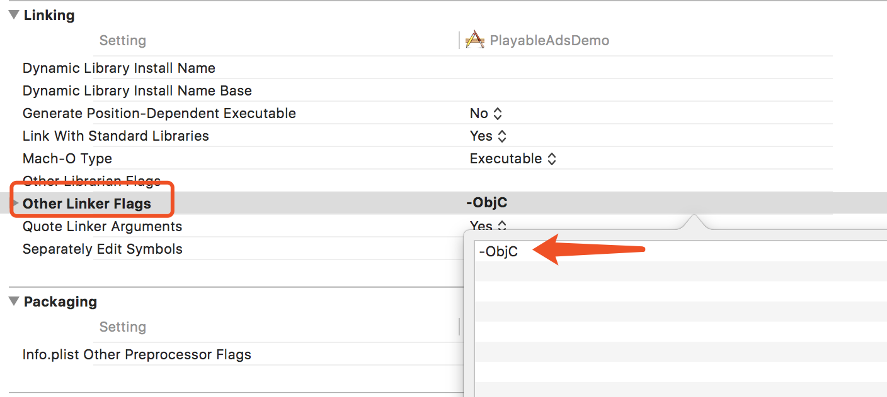

## 1.概述
### 1.1.面向读者
本产品面向需要在Xcode工程中接入ZPLAY Ads SDK的开发人员。
### 1.2.开发环境
- 操作系统：Mac OS X10.8.5版本及以上
- 开发环境：Xcode7及以上版本
- 部署目标：iOS8及以上
### 1.3.术语介绍
**APPID**：应用ID，是您在ZPLAY Ads平台创建媒体时获取的ID;

**adUnitID**：广告位ID，是您在ZPLAY Ads告平台为您的应用创建的广告位置的ID。
## 2.SDK接入
### 2.1 CocoaPods(推荐)
##### 2.1.1 安装CocoaPods/Install Cocoapods
```sh
sudo gem install cocoapods
```
##### 2.1.2 从终端切换至iOS项目根目录下，创建Podfile文件
```sh
pod init
```
##### 2.1.3 将ZPLAY Ads SDK加入到Podfile文件
```sh
pod 'PlayableAds'
```
##### 2.1.4 安装ZPLAY Ads SDK
```sh
pod install
```
### 2.2 手动集成ZPLAY Ads SDK
#### 2.2.1 下载ZPLAY Ads sdk 
在[**此处**](https://github.com/zplayads/PlayableAdsDemo-iOS/tree/master/sdk-framework)可以下载到ZPLAY Ads SDK，下载完成后解压.zip文件可得到PlayableAds.framework文件
#### 2.2.2 添加到工程
将上一步得到的PlayableAds.framework添加到项目中 

#### 2.2.3 添加ZPLAY Ads的依赖文件
ZPLAY Ads依赖的framework有：UIKit, Foundation, WebKit, SystemConfiguration, MobileCoreServices, AdSupport, CoreLocation, CoreTelephony, StoreKit, Security。

ZPLAY Ads依赖的libraries有：xml2.

导入后如图所示：
#### 2.2.4 其它设置
在项目中找到Build Settings页面，在Search Paths下的Header Search Paths下添加 $(SDKROOT)/usr/include/libxml2 ， 在Linking下的Other Linker Flags中添加 -ObjC 


## 3.接入代码
**3.1 初始化SDK**

初始化ZPLAY Ads广告，并显示视频。
> 广告预加载需要几秒时间，建议您在应用启动后尽早初始化及加载ZPLAY Ads广告。初始化SDK时需要将您在ZPLAY Ads平台申请的AppID和AdUnitID填入相应的位置，


```objective-c

@import PlayableAds;

@interface ViewController () <PlayableAdsDelegate>

// 创建广告并加载
- (PlayableAds *)createAndLoadPlayableAds {
PlayableAds *ad = [[PlayableAds alloc] initWithAdUnitID:@"Your Ad-Unit-ID" appID:@"Your App-ID"];
ad.delegate = self;
[ad loadAd];

return ad;
}
```
注：您在测试中可使用如下ID进行测试，测试ID不会产生收益，应用上线时请使用您申请的正式ID。

| 操作系统 | 广告形式 | App_ID                               | Ad_Unit_ID                           |
| ---- | ---- | ------------------------------------ | ------------------------------------ |
| iOS  | 激励视频 | A650AB0D-7BFC-2A81-3066-D3170947C3DA | BAE5DAAC-04A2-2591-D5B0-38FA846E45E7 |
| iOS  | 插屏   | A650AB0D-7BFC-2A81-3066-D3170947C3DA | 0868EBC0-7768-40CA-4226-F9924221C8EB |

**3.2 展示广告**

当广告已经准备就绪后，您可以使用以下方法播放广告：
```objective-c
// 展示广告
- (void)showAd {
    // ad is not ready, do nothing
    if (!self.ad.ready) {
        return;
    }

    // show the ad
    [self.ad present];
}
```
**3.3 判断广告是否加载完成**

您可以通过此回调判断是否有广告可以播放。
> 可通过此方法进行游戏内设置的判断。

```objective-c
- (void)playableAdsDidLoad:(PlayableAds *)ads {
    NSLog(@"playable ads did load");
}
```
**3.4 获取奖励**

视频奖励，您可以实现此回调给用户下发奖励，仅激励视频会有此回调。
> 当您在激励视频广告位上使用ZPLAY Ads时，最重要的是奖励看完广告的用户，要奖励用户请实现此回调。

```objective-c
#pragma mark - PlayableAdsDelegate
// 奖励用户，当您需要给用户激励时，可使用此回调判断是否有奖励下发。
- (void)playableAdsDidRewardUser:(PlayableAds *)ads {
    NSLog(@"playable ads did reward");
}
```
## 4 示例代码

```objective-c
#import "ViewController.h"

@import PlayableAds;

@interface ViewController () <PlayableAdsDelegate>

@property (nonatomic) PlayableAds *ad;

@end

@implementation ViewController

- (void)viewDidLoad {
    [super viewDidLoad];
    // Do any additional setup after loading the view, typically from a nib.
    self.ad = [self createAndLoadPlayableAds];
}


- (void)didReceiveMemoryWarning {
    [super didReceiveMemoryWarning];
    // Dispose of any resources that can be recreated.
}

- (IBAction)requestAdvertising:(UIButton *)sender {
    NSLog(@"request advertising.");
    [self.ad loadAd];
}

- (IBAction)presentAdvertising:(UIButton *)sender {
    [self showAd];
}

// Create an ad and start preloading
- (PlayableAds *)createAndLoadPlayableAds {
    PlayableAds *ad = [[PlayableAds alloc] initWithAdUnitID:@"iOSDemoAdUnit" appID:@"iOSDemoApp" rootViewController:self];
    ad.delegate = self;
    return ad;
}

// Show the ad
- (void)showAd {
    // ad is not ready, do nothing
    if (!self.ad.ready) {
        return;
    }
    
    // show the ad
    [self.ad present];
}
 

#pragma mark - PlayableAdsDelegate
- (void)playableAdsDidRewardUser:(PlayableAds *)ads {
    NSLog(@"Advertising successfully presented");
}

/// Tells the delegate that succeeded to load ad.
- (void)playableAdsDidLoad:(PlayableAds *)ads {
    NSLog(@"Advertising is ready to play.");
}

/// Tells the delegate that failed to load ad.
- (void)playableAds:(PlayableAds *)ads didFailToLoadWithError:(NSError *)error {
    NSLog(@"There was a problem loading advertising: %@", error);
}

/// Tells the delegate that user starts playing the ad.
- (void)playableAdsDidStartPlaying:(PlayableAds *)ads{
   NSLog(@"Advertising start playing");
}

/// Tells the delegate that the ad is being fully played.
- (void)playableAdsDidEndPlaying:(PlayableAds *)ads{
  NSLog(@"Advertising did end playing");
}

/// Tells the delegate that the landing page did present on the screen.
- (void)playableAdsDidPresentLandingPage:(PlayableAds *)ads{
  NSLog(@"Advertising start playing");
}

/// Tells the delegate that the ad did animate off the screen.
- (void)playableAdsDidDismissScreen:(PlayableAds *)ads{
  NSLog(@"Advertising did dismiss screen");
}

/// Tells the delegate that the ad is clicked
- (void)playableAdsDidClick:(PlayableAds *)ads{
  NSLog(@"Advertising did clicked");
}

@end
```

## 5 注意事项

### 5.1 请求广告返回400错误
检查工程是否设置了 **Display Name**

### 5.2 展示广告时出现黑屏
广告中可能出现http链接，在info.plist中添加以下代码
```
<key>NSAppTransportSecurity</key>
<dict>
<key>NSAllowsArbitraryLoads</key>
<true/>
</dict>
```
### 5.3 尽早请求广告
广告请求需要时间，为确保广告资源能够成功加载，建议尽快请求广告。

### 5.4 请求下一条广告

* 广告展示完成或请求失败时会自动加载下一条广告，如果自动加载失败会在5s后重试。

* 若您需要手动加载下一条广告，可将通过```playableAd.autoload = NO```来设置SDK不自动加载下一条广告。默认为自动加载。

### 5.4 插屏广告与激励视频广告

* 从2.0.3版本开始，您在申请广告位时可选择插屏广告还是激励视频广告，若广告位是插屏，广告开始后可中途关闭，且不会下发奖励。若广告位是激励视频，广告不可中途关闭，播放完成会给用户下发奖励。
* 当您的广告位是插屏广告形式时，不会触发`- (void)playableAdsDidRewardUser:(PlayableAds *)ads`方法，其余方法均与激励视频广告位一致。
