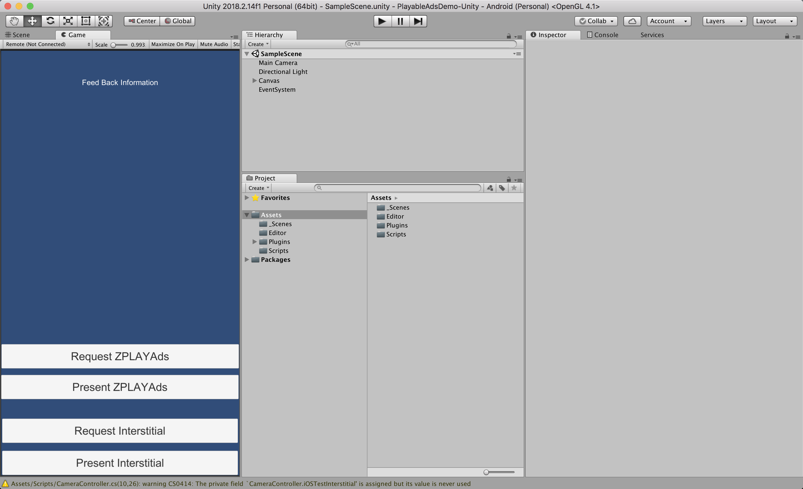

## PlayableAdsSDK for Unity
  1. 概述
  2. Demo简介
  3. 导入PlayableAds.unitypackage
  4. 安装可玩SDK

## 概述
    1. 面向人群，本产品主要面向需要在Unity产品中接入可玩广告SDK的开发者
    2. 开发环境配置
        - iOS:
            Xcode 7.0或更高版本
            iOS 8.0或更高版本
        - Android:
            Android 4.0或更高版本
    3. 示例所使用的环境
        - iOS
            mac：macOS Sierra 10.13.4
            unity: version 2017.1.1f1 Personal
            xcode: Version 9.3
            cocoapods: 1.4.0
        - Andoird
            mac：macOS Sierra 10.13.4
            unity: version 2017.1.1f1 Personal

## Demo简介
下载Demo源码后导入到Unity中，打开场景SampleScene.unity

### 1. 主体界面及基本配制，如下所示

### 2. Main Camera的控件文件如下


本示例以Main Camera为广告事件接收对象，可以使用其它GameObject作为可玩广告事件接收对象，但要保证请求广告方法与事件接收所处于同一个GameObject下。

使用多个GameObject请求广告时，只以最后一个GameObject为准。

## 导入PlayableAds.unitypackage

### 1. 导入可玩插件包
Android与iOS使用同一个插件包，导入步骤为Assets-> Import Package -> Custom Package...

点此下载[PlayableAds.unitypackage](./PlayableAds.unitypackage)


### 2. 选择下载好的PlayableAds插件包，双击打开


### 3. 按需导入相关文件
a. 如果您既需要Android又需要iOS，导入全部文件（其中包括iOS插件与Android插件），如图：

注意：示例中android-support-v4.jar与play-services-xxx.aar为可选导入项，如果这些文件与您项目中的文件有冲突，请放心地删除这些文件。

b. 如果您只需要iOS，点击[此处](./PlayableAds-iOS.unitypackage)下载插件包，如图：


c. 如果您只需要Android，点击[此处](./PlayableAds-Android.unitypackage)下载插件包，如图：


注：如果出现文件名称冲突，请手动修改文件名与类名，只要确保调用时一致就可以。

### 4. 添加代码
#### a. 添加iOS代码
-  初始化广告
    ```c#
    // APP_ID为你在ZPLAY Ads平台申请的应用ID
    PlayableAdsBridge.Init(gameObjectName, APP_ID);
    ```
-  请求广告
    ``` c#
    // AD_UNIT_ID为你在ZPLAY Ads平台申请的广告位ID
    PlayableAdsBridge.RequestAd(AD_UNIT_ID);
    ```
-  判断广告是否加载完成
    ``` c#
    PlayableAdsBridge.IsReady(AD_UNIT_ID);
    ```
-  展示广告
    ``` c#
    PlayableAdsBridge.PresentAd(AD_UNIT_ID);
    ```
-  设置自动加载下一条广告
   ``` c#
   PlayableAdsBridge.Autoload(bool);
   ```
   默认为自动加载，即经首次请求广告后，后续SDK会自动加载下一条广告，不需要再次调用请求方法。

-  判断广告是否自动加载下一条广告
   ``` c#
   PlayableAdsBridge.IsAutoload();
   ```
-  自定义事件
    ```c#
    // 位置：Demo/Assets/Scripts/PlayableAdsBridge.IPlayableListener
    interface IPlayableListener{
      	// 奖励
        void PlayableAdsDidRewardUser(string msg);

        // 广告加载成功
        void PlayableAdsDidLoad(string msg);

        // 广告加载失败
        void DidFailToLoadWithError(string error);

        // 用户开始播放广告
        void PlayableAdsDidStartPlaying(string msg);

        // 广告播放完成
        void PlayableAdsDidEndPlaying(string msg);

        // 展示广告落地页
        void PlayableAdsDidPresentLandingPage(string msg);

        // 关闭广告，广告消失
        void PlayableAdsDidDismissScreen(string msg);

        // 广告被点击
        void PlayableAdsDidClick(string msg);
    }
    ```

#### b. 添加Android代码
-  初始化SDK
    ``` c#
    // APP_ID为你在ZPLAY Ads平台申请的应用ID
    PlayableAdsAdapter.Init(gameObjectName, APP_ID);
    ```
-  设置自动请求
    ``` c#
    // 自动请求下个广告
    PlayableAdsAdapter.AutoloadAd(bool);
    ```
-  请求广告
    ``` c#
    PlayableAdsAdapter.RequestAd(AD_UNIT_ID);
    ```
-  判断广告是否加载完成
    ``` c#
    PlayableAdsAdapter.IsReady(AD_UNIT_ID)
    ```
-  展示广告
    ``` c#
    PlayableAdsAdapter.PresentAd(AD_UNIT_ID)
    ```
-  自定义事件
    ``` c#
    // 位置：Demo/Assets/Scripts/PlayableAdsAdapter.IPlayableAdapterListener
    interface IPlayableAdapterListener{

        // 广告已经加载完毕，可以调用PresentAd展示广告了
        void OnLoadFinished(string msg);

        // 广告加载失败，可根据error信息查找原因
        void OnLoadFailed(string error);

        // 此时，用户已经看完整个广告了，可以下发奖励
        void PlayableAdsIncentive(string msg);

        // 可玩SDK其它回调信息，详情查看msg
        void PlayableAdsMessage(string msg);
    }
    ```
    **注意事项**：

1.自定义事件要与广告请求时的GameObject同属一个，如本示例的GameObject均为Main Camera。

2.您在测试中可使用如下id进行测试，测试id不会产生收益，应用上线时请使用您申请的正式id。

| 操作系统    | App_ID                               | Ad_Unit_id                           |
| ------- | ------------------------------------ | ------------------------------------ |
| Android | 5C5419C7-A2DE-88BC-A311-C3E7A646F6AF | 3FBEFA05-3A8B-2122-24C7-A87D0BC9FEEC |
| iOS     | A650AB0D-7BFC-2A81-3066-D3170947C3DA | BAE5DAAC-04A2-2591-D5B0-38FA846E45E7 |

## 安装可玩SDK
以下为iOS 可玩SDK的安装步骤，Android可玩SDK已经包含在插件包里了，不需要额外安装。
### 1. 进入Unity导出的xcode项目根目录下，初始化pod，如示例中的iOSProj目录

### 2. 初始化pod后会生成Podfile文件，在此文件下添加可玩sdk
确保将```pod 'PlayableAds', '~>2.0.6'```添加到Podfile中即可。
注意：可玩广告SDK最低支持ios8.0，

### 3. 安装可玩sdk
```
pod install
```

看到红线圈出的部分代表可玩广告SDK安装成功，此时可以运行项目查看运行效果了，步骤如下
### 4. 验证SDK是否安装成功
双击打开.xcworkspace文件，在xcode中安装应用到iPhone

注意：此处打开的是 **.xcworkspace** 文件，而非.xcodeproj
### 5. 预览demo
完整流程如下：
* 点击“Request”开始请求广告
* 广告加载完成后提示“PlayableAdsDidLoad”
* 此时点击“Present”展示广告
* 广告展示完成后，点击“X”关闭广告，此时接收到“PlayableAdsDidRewardUser”消息。


接入过程中若有疑问，请参考示例程序或发送邮件至service@zplayads.com
